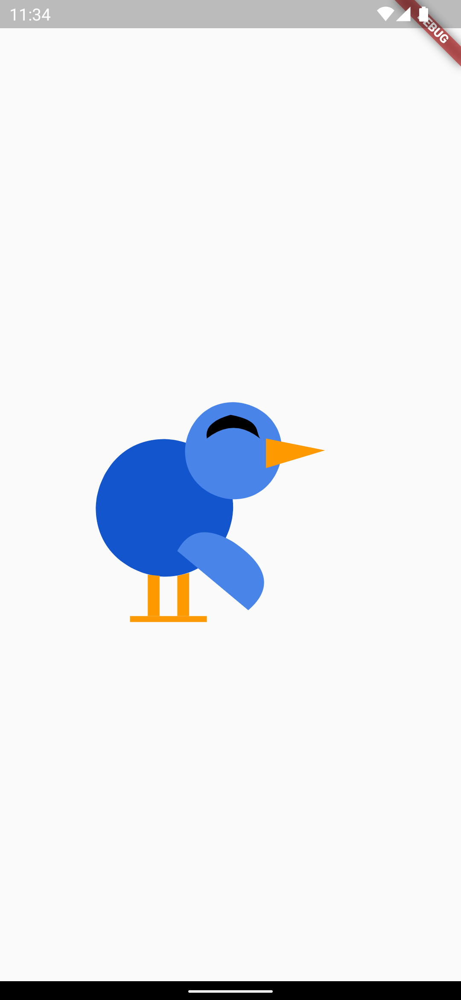
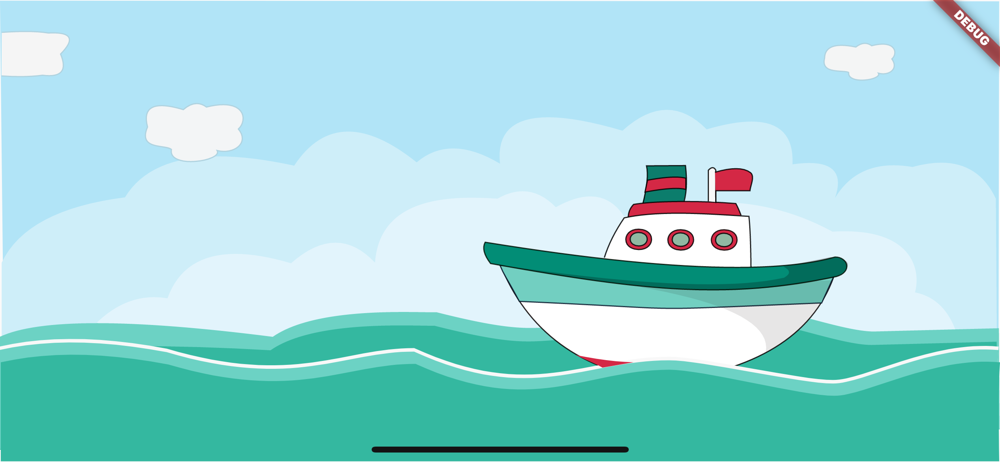
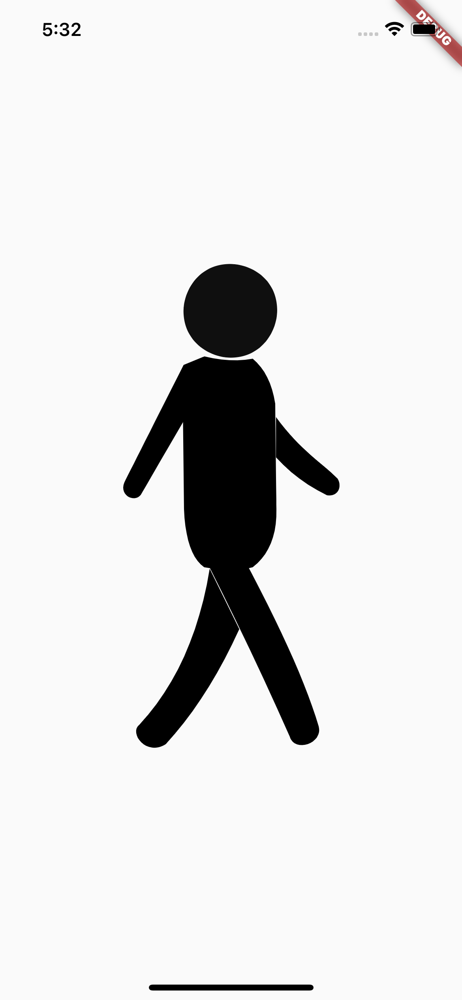

# 🏡 Flutter Custom Paint Projects

This flutter project consists of different little Flutter paintings done with custom paint in flutter.

## 💻 Requirements
* Any Operating System (ie. MacOS X, Linux, Windows)
* Any IDE with Flutter SDK installed (ie. IntelliJ, Android Studio, VSCode etc)
* A little knowledge of Dart and Flutter

## 📸 ScreenShots
||
|

## 🤓 Author(s)
**Okocha Ebube**

## 🔖 LICENCE
[Apache-2.0]